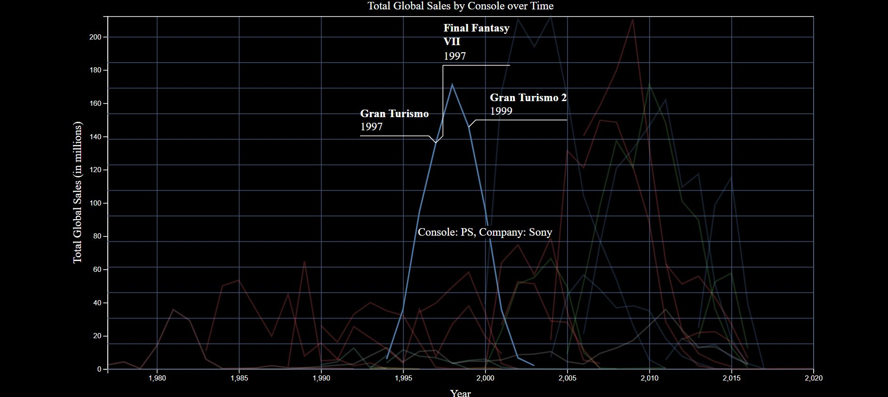

# Narrative Visualization for Video Game Sales Data

This GitHub repository is my code for a narrative visualization involving video game sales data over time using Javascript and D3. I solo developed this for my final project for the graduate version of CS 416: Data Visualization. The focus on this project was learning D3 and creating a narrative visualization.

The script in action can be found <a href="https://caseyrodgers.online/custom_files/cs416_narr_viz/index.html" target="_blank">here</a>.

The code creates a narrative visualization that shows video game sales over time and the top video games in different categories. The first tab shows the total video game sales over time for all video games with the top 3 games and their corresponding year labeled on the graph when the user clicks on it. A table with the top 50 selling video games of all time are shown below the graph. The table gives the game's rank, title, year, genre, platform, publisher, and global sales in millions.

The second tab shows the video game sales over time for each console and a table of the top 50 selling games for each console. The user just needs to click on the line they're interested in to see the top 3 games labeled on the graph and a table of the top 50 selling games. Once the user clicks on a line, the other lines fade some so that the clicked on line is more emphasized and easier to see. Also, the user can hover their tooltip over each line to see the console that the line represents. The colors of the lines match with the company that made them. For instance, Sony is blue and Mircosoft is green. This allows the user to see the trends with companies over time. 

The third tab shows the video game sales over time for each genre. This is similar to the second tab, except instead of consoles, the lines are differentiated by genre. Also each genre has its own color. A table of the top 50 selling games in the selected genre also show up underneath the graph.

The first figure shows the beginning text and the tabs for the different sorting types.

The second figure shows the graph for total video game sales sorted by different consoles. In the figure, the line for PS is selected and highlighted with the top 3 selling games labeled at their respective years.

The third figure shows a table of the top 50 selling Role Playing games along with the total global sales over the genre's lifetime. The table contains additional information about each game.

The data came from <a href="https://www.kaggle.com/datasets/gregorut/videogamesales?resource=download" target="_blank">here</a>. References for the project can be seen in the code itself.